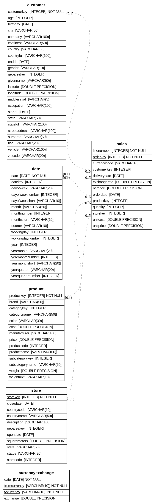

# Intermediate SQL Project: Customer Analysis

This intermediate-level SQL project demonstrates advanced data analysis techniques using the contoso_100k sample retail database. The project showcases various SQL concepts including complex joins, window functions, cohort analysis, and customer segmentation, making it ideal for those looking to enhance their SQL skills beyond the basics.

## Files Overview

### 1. Customer Segmentation Analysis (`1_customer_segmentation.sql`)

This analysis segments customers into three value tiers based on their Lifetime Value (LTV):

- Low Value (bottom 25th percentile)
- Mid Value (25th to 75th percentile)
- High Value (top 25th percentile)

The analysis provides:

- Total LTV per segment
- Customer count per segment
- Average LTV per customer in each segment

### 2. Cohort Analysis (`2_cohort_analysis.sql`)

This file contains a view definition (`cohort_analysis`) that:

- Calculates customer revenue metrics
- Tracks first purchase dates
- Groups customers by cohort year
- Includes customer demographics (country, age, name)

The view combines data from:

- Sales table (revenue calculations)
- Customer table (demographic information)

### 3. Retention Analysis (`3_retention_analysis.sql`)

This analysis examines customer retention and churn by:

- Identifying customer's last purchase date
- Classifying customers as 'Active' or 'Churned' (based on 6-month inactivity)
- Analyzing retention rates by cohort year
- Calculating:
  - Customer counts by status
  - Total customers per cohort
  - Percentage of customers in each status

## SQL Views for Code Reusability

The project implements SQL Views to promote code reusability and maintainability. Views serve as virtual tables that encapsulate complex queries, making the analysis more modular and easier to maintain.

### Example: Cohort Analysis View

```sql
CREATE OR REPLACE VIEW public.cohort_analysis AS
WITH customer_revenue AS (
    SELECT
        s.customerkey,
        s.orderdate,
        SUM(quantity*netprice*exchangerate) AS total_net_revenue,
        COUNT(s.orderkey) AS num_orders,
        c.countryfull,
        c.age,
        c.givenname,
        c.surname
    FROM sales s
    LEFT JOIN customer c ON c.customerkey = s.customerkey
    GROUP BY
        s.customerkey,
        s.orderdate,
        c.countryfull,
        c.age,
        c.givenname,
        c.surname
)
SELECT
    customerkey,
    total_net_revenue,
    num_orders,
    countryfull,
    age,
    CONCAT(TRIM(givenname), ' ', TRIM(surname)) AS cleaned_name,
    MIN(cr.orderdate) OVER (PARTITION BY cr.customerkey) AS first_purchase_date,
    EXTRACT(YEAR FROM MIN(cr.orderdate) OVER (PARTITION BY cr.customerkey)) AS cohort_year
FROM customer_revenue cr;
```

This view demonstrates several intermediate SQL concepts:

- Common Table Expressions (WITH clause)
- Window functions (OVER clause)
- Aggregate functions with GROUP BY
- JOIN operations
- String manipulation (CONCAT, TRIM)
- Date functions (EXTRACT)

The view simplifies cohort analysis by providing a reusable dataset that combines customer demographics with their purchase history and cohort information.

### View Usage Example

The `cohort_analysis` view is utilized throughout the project. For example, in the retention analysis:

```sql
-- Using cohort_analysis view in retention analysis
SELECT
    customerkey,
    cleaned_name,
    orderdate,
    ROW_NUMBER() OVER (PARTITION BY customerkey ORDER BY cohort_year DESC) AS rn,
    first_purchase_date,
    cohort_year
FROM cohort_analysis
```

This demonstrates how views make the code:

- More maintainable: Complex logic is defined once in the view
- Reusable: The same customer cohort logic can be used across different analyses
- Readable: Business logic is encapsulated, making queries cleaner and more focused

## Data Structure

The analyses use the following tables from the contoso_100k database:

- `currencyexchange`: Contains exchange rate information for different currencies
- `customer`: Contains customer demographic information including:
  - Customer details
  - Geographic information
  - Demographic data
- `date`: Contains date dimension data for time-based analysis
- `product`: Contains product information including:
  - Product details
  - Categories
  - Pricing information
- `sales`: Contains transaction data including:
  - Order details
  - Product information
  - Sales amounts
  - Transaction dates
- `store`: Contains store information including:
  - Store details
  - Location information
  - Store performance metrics

These tables are related through foreign keys, allowing for comprehensive analysis across different dimensions of the retail business.

## Key Metrics

- Customer Lifetime Value (LTV)
- Cohort-based analysis
- Retention rates
- Churn rates
- Customer segmentation

## Database Schema



The database consists of six main tables:

1. **Customer**: Stores customer demographics, location, and personal details
2. **Sales**: Contains transaction data with costs, prices, and quantities
3. **Date**: Dimensional table with various date/time period breakdowns
4. **Product**: Product information including categories, pricing, and specifications
5. **Store**: Store location details and operational information
6. **Currencyexchange**: Currency conversion rates and codes

Tables are interconnected via foreign keys, enabling comprehensive cross-table analysis.

## Usage

Each SQL file can be run independently to perform its specific analysis. The `cohort_analysis` view should be created first as it's used by other analyses.

## SQL Optimization Practices

This project follows these SQL optimization practices:

- **Selective Column Retrieval**: Only necessary columns are selected in queries
- **Efficient Filtering**: WHERE clauses are used before aggregations
- **Controlled Result Sets**: Appropriate use of LIMIT for large datasets
- **Optimized Joins**:
  - Strategic use of LEFT JOINs where appropriate
  - Joins are performed on indexed columns
- **Efficient Aggregations**:
  - GROUP BY is used only when necessary
  - Aggregations are performed after filtering
- **Execution Plan Awareness**:
  - Queries are structured to optimize execution paths
  - Window functions are used efficiently

Note: Advanced database-level optimizations (indexing, partitioning, etc.) are handled by the database engineering team.

## Acknowledgments

Special thanks to [Luke Barousse](https://www.youtube.com/@LukeBarousse) for his excellent SQL course that inspired this project. The course content and examples were instrumental in developing these analyses.

Course Reference: [Intermediate SQL Course](https://www.youtube.com/watch?v=QKIGsShyEsQ)
